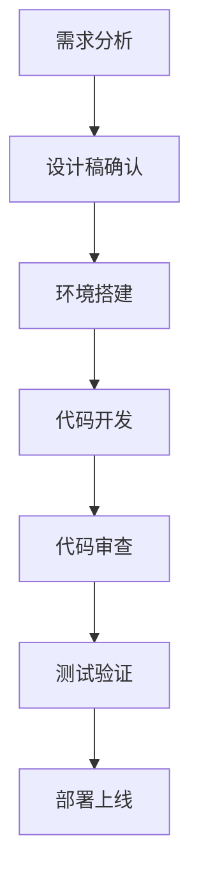
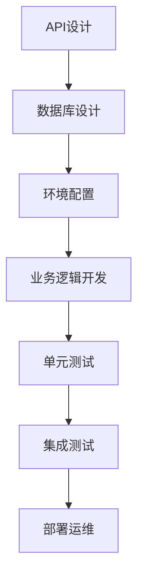

# 🔧 开发工具与环境配置

## 🛠️ 编程世界的工具箱

工欲善其事，必先利其器。选择合适的开发工具和环境配置，能让你的编程之旅事半功倍。本模块将为你介绍各种必备的开发工具和配置方法。

## 🎯 学习目标

完成本模块学习后，你将能够：
- 掌握主流开发工具的安装和使用
- 配置高效的开发环境
- 使用版本控制和协作工具
- 搭建完整的开发工作流

## 📚 工具分类指南

### 1. [代码编辑器与IDE](01-code-editors-ide.md) 💻
**核心工具**：VS Code、IntelliJ IDEA、PyCharm
- **VS Code**：轻量级、插件丰富、跨平台
- **IntelliJ IDEA**：Java开发首选、功能强大
- **PyCharm**：Python专业IDE、智能提示
- **WebStorm**：前端开发专业工具

### 2. [版本控制工具](02-version-control.md) 📝
**核心工具**：Git、GitHub、GitLab
- **Git**：分布式版本控制系统
- **GitHub**：全球最大代码托管平台
- **GitLab**：企业级代码管理平台
- **SVN**：集中式版本控制系统

### 3. [命令行工具](03-command-line.md) ⌨️
**核心工具**：Terminal、PowerShell、WSL
- **Windows Terminal**：现代化命令行
- **PowerShell**：强大的脚本语言
- **WSL**：Windows下的Linux环境
- **iTerm2**：macOS终端增强

### 4. [包管理与构建工具](04-package-build.md) 📦
**核心工具**：npm、yarn、Maven、Gradle
- **npm/yarn**：JavaScript包管理
- **Maven/Gradle**：Java构建工具
- **pip/conda**：Python包管理
- **Docker**：容器化部署

### 5. [数据库管理工具](05-database-tools.md) 💾
**核心工具**：MySQL Workbench、pgAdmin、MongoDB Compass
- **MySQL Workbench**：MySQL图形化管理
- **pgAdmin**：PostgreSQL管理工具
- **MongoDB Compass**：MongoDB可视化
- **DBeaver**：通用数据库工具

### 6. [API测试与调试工具](06-api-debugging.md) 🔍
**核心工具**：Postman、Chrome DevTools、Fiddler
- **Postman**：API测试和文档
- **Chrome DevTools**：前端调试神器
- **Fiddler**：网络请求抓包
- **Charles**：HTTP代理调试

### 7. [性能监控与分析工具](07-performance-monitoring.md) 📊
**核心工具**：JProfiler、VisualVM、Grafana
- **JProfiler**：Java性能分析
- **VisualVM**：JVM监控工具
- **Grafana**：数据可视化监控
- **Prometheus**：系统监控告警

## 💡 开发环境配置指南

### 操作系统选择
| 系统 | 优点 | 适用场景 |
|------|------|----------|
| **Windows** | 用户友好、软件丰富 | 企业开发、游戏开发 |
| **macOS** | Unix环境、设计优秀 | 移动开发、前端开发 |
| **Linux** | 开源免费、性能优秀 | 服务器、嵌入式开发 |

### 语言环境配置

#### Python环境
```bash
# 安装Python
$ python --version
Python 3.9.0

# 使用虚拟环境
$ python -m venv myenv
$ source myenv/bin/activate
```

#### Node.js环境
```bash
# 安装Node.js
$ node --version
v16.13.0

# 使用nvm管理版本
$ nvm install 16
$ nvm use 16
```

#### Java环境
```bash
# 安装JDK
$ java -version
java version "17.0.1"

# 配置环境变量
JAVA_HOME=/path/to/jdk
PATH=$JAVA_HOME/bin:$PATH
```

## 🛠️ 工具安装指南

### VS Code安装配置
1. **下载安装**：官网下载对应版本
2. **必备插件**：
   - Chinese Language Pack（中文语言包）
   - Prettier（代码格式化）
   - ESLint（代码检查）
   - GitLens（Git增强）
   - Live Server（本地服务器）

3. **配置示例**：
```json
{
  "editor.fontSize": 14,
  "editor.formatOnSave": true,
  "files.autoSave": "afterDelay"
}
```

### Git安装配置
1. **下载安装**：官网下载对应版本
2. **基础配置**：
```bash
# 配置用户信息
$ git config --global user.name "你的名字"
$ git config --global user.email "你的邮箱"

# 生成SSH密钥
$ ssh-keygen -t rsa -C "你的邮箱"
```

3. **常用命令**：
```bash
# 克隆仓库
$ git clone https://github.com/user/repo.git

# 提交更改
$ git add .
$ git commit -m "提交说明"
$ git push origin main
```

## 🌟 开发工作流设计

### 前端开发工作流


### 后端开发工作流


## 📊 工具对比分析

### 代码编辑器对比
| 工具 | 优点 | 缺点 | 适用场景 |
|------|------|------|----------|
| **VS Code** | 轻量、插件丰富、免费 | 大型项目稍慢 | 全栈开发、快速原型 |
| **IntelliJ IDEA** | 功能强大、智能提示 | 资源占用大、收费 | 企业级Java开发 |
| **PyCharm** | Python专业、调试强大 | 仅限Python、收费 | Python数据科学 |
| **Sublime Text** | 快速、简洁、跨平台 | 插件生态一般 | 文本编辑、轻量开发 |

### 版本控制工具对比
| 工具 | 类型 | 优点 | 适用场景 |
|------|------|------|----------|
| **Git** | 分布式 | 强大、灵活、离线工作 | 个人和团队开发 |
| **SVN** | 集中式 | 简单、权限控制强 | 传统企业项目 |
| **Mercurial** | 分布式 | 简单易用、性能好 | 小型团队项目 |

## 🔧 环境问题排查

### 常见环境问题
1. **环境变量配置错误**
   - 检查PATH变量
   - 确认JAVA_HOME等变量

2. **端口占用问题**
   - 使用`netstat -ano`查看端口
   - 使用任务管理器结束进程

3. **依赖冲突问题**
   - 检查版本兼容性
   - 使用虚拟环境隔离

### 调试技巧
1. **日志分析**
   - 查看应用日志
   - 分析错误堆栈

2. **网络调试**
   - 使用Fiddler抓包
   - 检查网络连接

3. **性能分析**
   - 使用性能监控工具
   - 分析内存和CPU使用

## 📈 工具学习路径

### 第一阶段：基础工具（1-2周）
- ✅ 掌握代码编辑器基本操作
- ✅ 学会Git基础命令
- ✅ 配置开发环境
- ✅ 完成第一个项目配置

### 第二阶段：进阶工具（2-3周）
- ✅ 掌握IDE高级功能
- ✅ 学习Git分支管理
- ✅ 配置自动化构建
- ✅ 掌握调试技巧

### 第三阶段：专业工具（3-4周）
- ✅ 掌握性能分析工具
- ✅ 学习容器化部署
- ✅ 配置CI/CD流程
- ✅ 搭建完整开发环境

## 🔗 资源推荐

### 官方下载地址
- **VS Code**：https://code.visualstudio.com/
- **IntelliJ IDEA**：https://www.jetbrains.com/idea/
- **Git**：https://git-scm.com/
- **Docker**：https://www.docker.com/

### 学习资源
- **官方文档**：各工具官方文档
- **YouTube教程**：工具使用视频
- **B站教程**：国内工具教学
- **GitHub项目**：开源工具配置

### 社区支持
- **Stack Overflow**：技术问题解答
- **GitHub Issues**：工具问题反馈
- **Reddit社区**：工具使用讨论
- **知乎专栏**：国内技术分享

---

## 🚀 开始配置你的开发环境

**点击上面的工具分类开始学习！**

> 记住：好的工具能让你事半功倍，但更重要的是理解工具背后的原理。不要成为工具的奴隶，而要成为工具的主人。

### 配置建议：
1. **从基础开始**：先掌握编辑器、Git、命令行
2. **按需选择**：根据项目需求选择合适工具
3. **持续学习**：工具在不断发展，保持学习
4. **实践为主**：通过实际项目掌握工具使用

---

*本模块内容将持续更新，为你提供最新、最实用的开发工具配置指南。祝你配置顺利！*